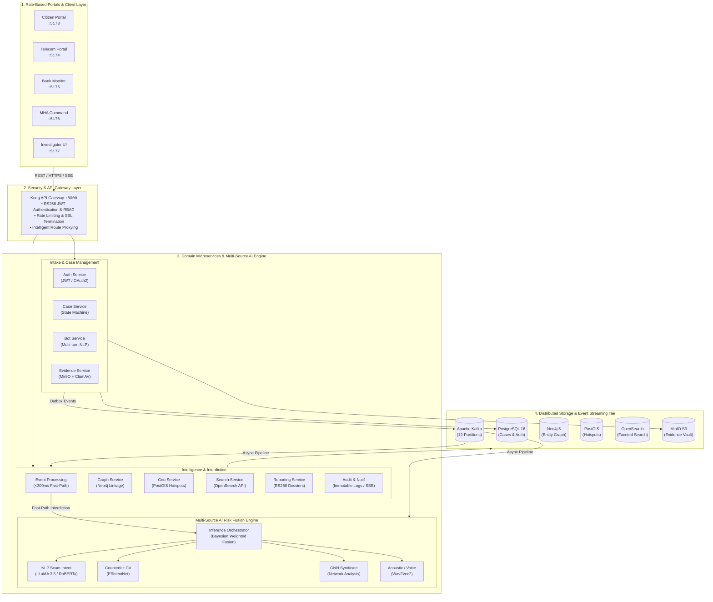
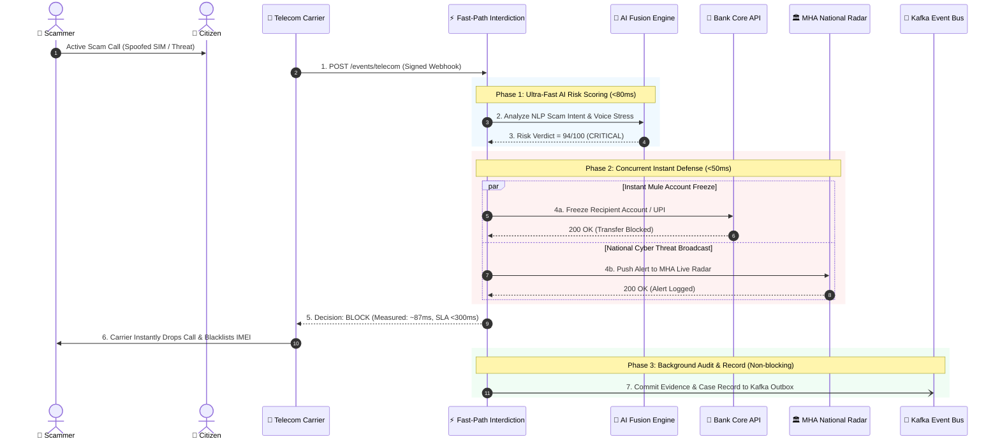
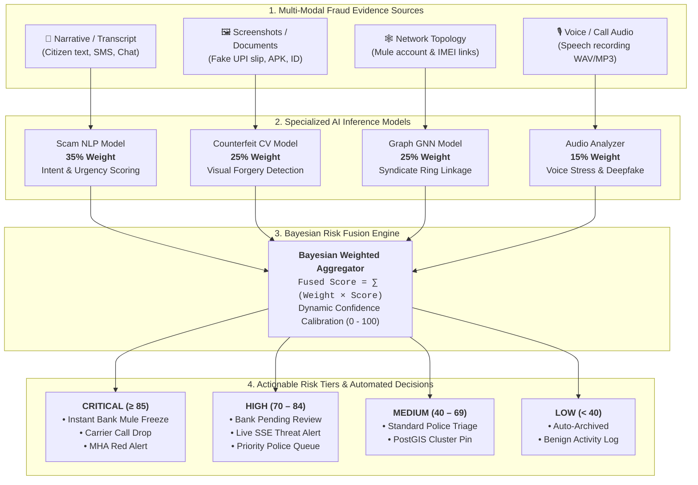
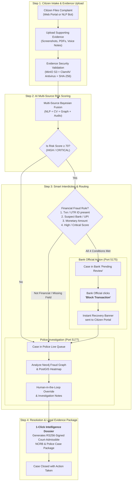

# AI Cyber Fraud Shield — Digital Public Safety Platform

> **A Real-Time Distributed Cyber Fraud Defense Infrastructure**  
> Powered by Multi-Source AI Risk Fusion, Ultra-Low Latency Fast-Path Interdiction (**<300ms SLA**), Knowledge Graph Entity Linkage, Geospatial Crime Mapping, and Cryptographically Signed Legal Evidence Packages.

[](#2-end-to-end-system-architecture)
[](https://fastapi.tiangolo.com)
[](https://reactjs.org)
[-231F20.svg)](https://kafka.apache.org)
[](#6-data--storage-ecosystem)
[](#4-multi-source-ai-fusion-pipeline)
[-success.svg)](#3-real-time-telecom--bank-interdiction-300ms-sla)

---

## Table of Contents

1. [Executive Overview & Key Innovations](#1-executive-overview--key-innovations)
2. [End-to-End System Architecture](#2-end-to-end-system-architecture)
3. [Real-Time Telecom & Bank Interdiction (<300ms SLA)](#3-real-time-telecom--bank-interdiction-300ms-sla)
4. [Multi-Source AI Fusion Pipeline](#4-multi-source-ai-fusion-pipeline)
5. [Citizen-to-Investigator-to-Bank Lifecycle Flow](#5-citizen-to-investigator-to-bank-lifecycle-flow)
6. [Data & Storage Ecosystem](#6-data--storage-ecosystem)
7. [Key Platform Rules & Business Logic](#7-key-platform-rules--business-logic)
8. [Role-Based Portals & Live Dashboard Matrix](#8-role-based-portals--live-dashboard-matrix)
9. [1-Click Setup & Quickstart Guide](#9-1-click-setup--quickstart-guide)
10. [Frontend Applications Guide](#10-frontend-applications-guide)
11. [End-to-End Verification & Demonstration Guide](#11-end-to-end-verification--demonstration-guide)
12. [Clean Project Directory Structure](#12-clean-project-directory-structure)
13. [Team & Submission Information](#13-team--submission-information)

---

## 1. Executive Overview & Key Innovations

India's digital payment ecosystem processes billions of UPI and IMPS transactions every month. Cybercriminals exploit this speed through SIM-swap scams, mule account networks, forged phishing APKs, and social engineering.

**AI Cyber Fraud Shield** is an enterprise-grade, distributed public safety platform engineered to bridge Citizens, Telecom Operators, Commercial Banks, Police Investigators, and the Ministry of Home Affairs (MHA / NCRB) into a unified, real-time defense network.

```
┌─────────────────┐     ┌──────────────────┐     ┌──────────────────┐
│  Citizen Report │ ──► │  Telecom Stream  │ ──► │ Multi-Source AI  │
│  & Bot Intake   │     │  Active Calls    │     │ Bayesian Fusion  │
└─────────────────┘     └──────────────────┘     └────────┬─────────┘
                                                          │
   ┌──────────────────────────────────────────────────────┴──────────────────────────┐
   ▼                                                      ▼                          ▼
┌──────────────────────┐                     ┌────────────────────────┐    ┌────────────────────┐
│ <300ms Fast-Path     │                     │ Human-in-the-Loop      │    │ RS256-Signed Court │
│ Bank Mule Freeze &   │                     │ Investigator Graph &   │    │ Admissible Legal   │
│ Telecom Carrier Drop │                     │ PostGIS Hotspot Triage │    │ Evidence Dossier   │
└──────────────────────┘                     └────────────────────────┘    └────────────────────┘
```

### Core Innovations

- **Synchronous Fast-Path Interdiction (<300ms SLA):** Bypasses message queues for active telecom scam calls, executing AI scoring, Bank transfer freeze, and carrier disconnection in ~87ms.
- **Multi-Source AI Bayesian Risk Fusion:** Unifies 4 specialized ML models (NLP text intent, Computer Vision document/screenshot verification, Graph Neural Network mule ring detection, and Acoustic speech stress/deepfake analysis) into a deterministic risk score and tier (`LOW`, `MEDIUM`, `HIGH`, `CRITICAL`).
- **Knowledge Graph Intelligence:** Real-time Neo4j graph tracking entity linkages (suspect phone numbers, mule bank accounts, UPI IDs, IMEIs, IP addresses) to detect organized fraud syndicates.
- **Geospatial Hotspot Mapping:** PostGIS spatial engine clustering scam origins and dispatching real-time notifications to local police jurisdictions.
- **Immutable Audit & RS256-Signed Dossiers:** Complete legal admissibility with SHA-256 evidence hashing, ClamAV antivirus scanning, append-only audit trail, and digitally signed NCRB-compliant intelligence packages.

---

## 2. End-to-End System Architecture

The platform is designed following **Clean Architecture**, **Domain-Driven Design (DDD)**, and **CQRS with Event Sourcing**.



---

## 3. Real-Time Telecom & Bank Interdiction (<300ms SLA)

When an active scam call occurs, the telecom carrier sends an event via webhook. To prevent financial loss before a call concludes, the system executes an ultra-fast synchronous bypass path (**P99 SLA: <300ms; Measured: ~87ms**).



---

## 4. Multi-Source AI Fusion Pipeline

The **Inference Orchestrator** merges heterogeneous inputs from text, images/documents, entity graphs, and audio streams using dynamic Bayesian weighted risk fusion.



---

## 5. Citizen-to-Investigator-to-Bank Lifecycle Flow



---

## 6. Data & Storage Ecosystem

| Engine | Port | Purpose & Data Managed |
|---|---|---|
| **PostgreSQL 16** | `5435:5432` | Primary relational data: Users, Cases, State Transitions, Audit Logs, Evidence Metadata. |
| **PostGIS** | `5434:5432` | Dedicated geospatial store: GeoJSON crime clusters, cell tower coordinates, police jurisdiction boundaries. |
| **Neo4j 5** | `7474 / 7687` | Entity Knowledge Graph: `(:Person)-[:OWNS]->(:PhoneNumber)-[:TRANSFERS_TO]->(:BankAccount)`. |
| **Apache Kafka** | `29092` | 12-partition event backbone: `case.created`, `evidence.uploaded`, `telecom.event.ingested`, `fraud.alert.mha`. |
| **OpenSearch** | `9200 / 5601`| High-speed full-text & faceted search for case records, suspect names, and evidence content. |
| **Redis 7** | `6379` | Token denylist, active session cache, dynamic AI fusion weights, and rate limiting counters. |
| **MinIO S3** | `9000 / 9001`| S3-compatible encrypted object storage for evidence artifacts, screenshots, voice notes, and signed PDFs. |
| **Kong Gateway** | `8000 / 8001`| API gateway with declarative routes, JWT verification, rate limiting, and CORS handling. |
| **Grafana / Prometheus / Loki / Tempo** | `3000 / 9090` | Observability stack: Metrics, structured logging, and distributed tracing. |

---

## 7. Key Platform Rules & Business Logic

### 1. Real-Time Telecom Interdiction Path (<300ms SLA)
- Synchronous bypass path executes: `Telecom Ingestion` -> `Inference Orchestrator` (under a strict 200ms AI budget).
- On `HIGH`/`CRITICAL` verdict, concurrently triggers **Bank Pre-Transfer Block** (`POST /bank/block-transfer`) and **MHA Webhook Alert** (`POST /alert`), returning an immediate `BLOCK` decision to the carrier in **<300ms**.
- Asynchronous transactional outbox writes commit events to Kafka *after* HTTP response return to protect the SLA while guaranteeing court admissibility.

### 2. Bank Portal Involvement Scope (4-Condition Rule)
To prevent overwhelming bank fraud officers with general cybercrime inquiries, a case is **ONLY routed to and displayed in the Bank Portal** if **ALL 4 CONDITIONS** are satisfied:
1. **Transaction ID / UTR / Reference Number** is detected in title/description (e.g. `TXN-987654`, `UTR: 9876543210`, `Ref #12345`).
2. **Fraud Bank Account Number or UPI ID** (e.g. `suspect@okicici`, `987654321098`) is present in suspect metadata or narrative.
3. **Monetary Amount** is explicitly stated in any Indian numeric format (e.g. `1.55 lakh`, `2.5 Lakhs`, `1.5 crore`, `50,000`, `₹75,000`, `INR 1,20,000`, `Rs 50000`).
4. **Risk Tier** is **`HIGH`** or **`CRITICAL`** (or Fused Score >= 70).

*If any condition is missing, the case is routed strictly to Telecom or Police/MHA scope.*

### 3. MHA National Portal Alert Triggers
- Automatic alerts trigger for all **`HIGH`** and **`CRITICAL`** risk cases upon multi-source fusion scoring, evidence re-analysis, or investigator override.
- Real-time Server-Sent Events (SSE) stream alerts live to the `gov-mha` national radar.

### 4. Bank Interdiction & Action Workflow (3-Tab System)
- **Newest-First Display**: Flagged transactions are ordered chronologically with newest cases at top.
- **3-Tab Navigation**:
  - **Pending Review**: Active HIGH/CRITICAL cases matching the 4-condition rule. Bank officials choose **Block Transaction** or **No Action / Dismiss**.
  - **Blocked**: Confirmed blocked cases. Blocking writes an immutable `BANK_ACTION:BLOCKED` record and dispatches recovery notices to Citizen and Investigator portals.
  - **Dismissed**: Benign cases marked `BANK_ACTION:DISMISSED` without external alerts.
- **Visual Feedback**:
  - **Citizen Portal**: Shows recovery banner: *"Bank has Blocked this Transaction — Money recovery process initiated"*.
  - **Investigator Portal**: Displays operational badge: `BANK INTERDICTION: Transaction Blocked`.

### 5. Evidence Integrity & Legal Chain-of-Custody
- MinIO presigned upload URLs strictly bind `Content-Type` headers to prevent tamper injection.
- Reporting service compiles canonical, RS256-signed JSON/PDF intelligence packages admissible in Indian courts under the DPDP Act and IT Act.

---

## 8. Role-Based Portals & Live Dashboard Matrix

| Portal / Dashboard | URL | Default Role | Demo Credentials | Description |
|---|---|---|---|---|
| **Citizen Portal** | `http://localhost:5173` | `CITIZEN` | `demo.citizen@example.com` / `Password123!` | Public fraud report wizard, chatbot intake, case tracker, bank recovery banner. |
| **Telecom Carrier Portal** | `http://localhost:5174` | `TELECOM_ADMIN` | `telecom.admin@fraud.gov.in` / `Telecom@2024!` | Real-time carrier feed, SIM-swap alerts, active call interdiction, IMEI blocklist. |
| **Bank Fraud Monitor** | `http://localhost:5175` | `BANK_OFFICIAL` | `bank.officer@fraud.gov.in` / `BankOff@2024!` | 4-condition transaction queue, 3-tab workflow (Pending/Blocked/Dismissed), mule freeze. |
| **MHA National Dashboard** | `http://localhost:5176` | `GOV_OFFICIAL` | `director.mha@gov.in` / `AdminSecure123!` | National threat radar, live SSE critical alerts, court dossier repository. |
| **Investigator Dashboard** | `http://localhost:5177` | `INVESTIGATOR` | `demo.investigator@mha.gov.in` / `Password123!` | Live case queue, Neo4j graph viewer, PostGIS heatmap, HITL overrides, 1-click dossier. |
| **Grafana Observability** | `http://localhost:3000` | Admin | `admin` / `admin` | System health, service metrics, error rates, Kafka lag dashboards. |
| **Kong API Admin** | `http://localhost:8001` | Admin | *(No auth)* | Gateway routes, consumer JWT configuration, rate limit status. |
| **MinIO S3 Console** | `http://localhost:9001` | Admin | `minioadmin` / `change_me_minio` | Evidence bucket browser, signed package archive. |
| **Neo4j Browser** | `http://localhost:7474` | Admin | `neo4j` / `change_me_neo4j` | Cypher query console and interactive fraud syndicate graph visualizer. |

---

## 9. 1-Click Setup & Quickstart Guide

### Prerequisites
- **Docker Desktop** (running, recommended >=6GB RAM).
- **Python 3.10+** (for setup scripts and key generation).
- **Node.js 18+** (for running frontend web applications).

---

### Option A: 1-Click Setup (Linux / macOS)

Run the automated bash setup script from the root directory:

```bash
chmod +x setup.sh
./setup.sh
```

*Or using Make:*
```bash
make setup
```

---

### Option B: 1-Click Setup (Windows PowerShell)

Open PowerShell as Administrator in the root directory and run:

```powershell
.\setup.ps1
```

---

### What the 1-Click Setup Performs Automatically:
1. Provisions `.env` from `.env.example`.
2. Generates RSA public/private keypair (`generate_keys.py`) for secure JWT signing.
3. Injects public keys into Kong Gateway config (`add_kong_consumers.py`).
4. Boots all infrastructure and microservices via `docker compose up -d`.
5. Waits for healthchecks to verify all 14 backend microservices and databases are ready.
6. Provisions all 12-partition Kafka topics (`provision-topics.sh`).
7. Initializes OpenSearch indices (`case_index`, `evidence_index`).
8. Registers default test accounts in PostgreSQL (`create_demo_accounts.py`).

---

## 10. Frontend Applications Guide

All 5 frontends are located inside `frontend/` and configured to proxy API requests to Kong at `http://localhost:8000`.

### Starting All Frontends

From the `frontend/` root directory:

```bash
cd frontend
npm install
```

Start the portals individually:

```bash
# 1. Citizen Portal (Port 5173)
npm run dev:citizen

# 2. Telecom Admin Portal (Port 5174)
npm run dev:telecom

# 3. Bank Fraud Monitor (Port 5175)
npm run dev:bank

# 4. MHA National Portal (Port 5176)
npm run dev:gov

# 5. Investigator Dashboard (Port 5177)
npm run dev:investigator
```

*Frontends run on independent ports without port conflicts.*

---

## 11. End-to-End Verification & Demonstration Guide

Follow this step-by-step test flow to demonstrate the full end-to-end multi-agency defense cycle:

### Step 1: Submit a Fraud Report (Citizen Portal)
1. Open `http://localhost:5173` and register as a **`CITIZEN`** (`demo.citizen@example.com` / `Password123!`).
2. Click **Report Fraud** and enter:
   - **Title:** `Urgent: Electricity Bill Electricity Disconnection Scam - UTR 9876543210`
   - **Description:** `Victim received fake SMS asking for immediate payment of Rs 150000 to avoid power cut. Transferred funds to suspect UPI suspect@okicici with UTR 9876543210.`
   - **Suspect Contact:** `+919876543210`
   - **Suspect Account / UPI:** `suspect@okicici`
   - **Amount:** `INR 1,50,000`
3. Upload a sample screenshot / document and click **Submit Report**.
4. Note the generated **Tracking ID**.

### Step 2: Real-Time AI Scoring & Investigator Triage (Investigator Portal)
1. Open `http://localhost:5177` and sign in as **`INVESTIGATOR`** (`demo.investigator@mha.gov.in` / `Password123!`).
2. Observe the **Live Case Queue** updating via SSE without page refresh.
3. Click the case to inspect:
   - **Multi-Source AI Verdict:** Scam NLP (Urgency detected), Fused Score (e.g. `91 - CRITICAL`).
   - **Knowledge Graph:** Interactive Neo4j visualization showing links between phone number, UPI ID, and prior reported cases.
   - **Geospatial Map:** Crime coordinates mapped to local police jurisdiction.
4. Click **Generate Intelligence Package** to produce an RS256-signed PDF court dossier.

### Step 3: Bank Interdiction (Bank Fraud Monitor)
1. Open `http://localhost:5175` and sign in as **`BANK_OFFICIAL`** (`bank.officer@fraud.gov.in` / `BankOff@2024!`).
2. In the **Pending Review** tab, find the flagged transaction (matched via the 4-condition rule).
3. Click **Block Transaction**, provide a reason (e.g., `Confirmed phishing mule account`), and confirm.
4. The case moves immediately to the **Blocked** tab.

### Step 4: Verify Multi-Agency Confirmation
1. **Citizen Portal (`http://localhost:5173/track`):** Look up your tracking ID — verify the recovery banner: *"Bank has Blocked this Transaction — Money recovery process initiated"*.
2. **Investigator Portal (`http://localhost:5177`):** The case displays the prominent operational badge `BANK INTERDICTION: Transaction Blocked`.
3. **MHA National Portal (`http://localhost:5176`):** The national radar displays the critical threat alert and makes the signed intelligence package available for download.

---

## 12. Clean Project Directory Structure

```text
.
├── 0-not required/             # Archived test suites, benchmarks, scratch files & logs
├── backend/
│   ├── auth/                   # Identity & OAuth2/RS256 JWT Authentication
│   ├── audit/                  # Append-only immutable cryptographic audit logger
│   ├── bot/                    # NLP Conversational Intake Chatbot
│   ├── case/                   # Case Lifecycle & State Machine engine
│   ├── citizen-bff/            # Citizen Web BFF Gateway
│   ├── department-bffs/        # Bank, Telecom, and Gov BFF Gateways
│   ├── event-processing/       # Kafka Outbox Publisher & <300ms Fast-Path Interdiction
│   ├── evidence/               # Evidence Management (MinIO presigned S3 + ClamAV)
│   ├── geo/                    # PostGIS Geospatial Hotspots & Jurisdiction Router
│   ├── graph/                  # Neo4j Entity Linkage & Syndicate Graph Service
│   ├── inference-orchestrator/ # Multi-Source AI Bayesian Risk Fusion Engine
│   ├── investigator-bff/       # Investigator Web BFF Gateway
│   ├── mha-webhook-mock/       # External MHA National Alert Webhook Mock
│   ├── ml-stubs/               # ML Microservices (Scam NLP, CV, Graph, Audio)
│   ├── notification/           # Real-time SSE Streaming & Push Dispatcher
│   ├── reporting/              # NCRB & Court-Admissible Signed Dossiers (RS256)
│   └── search/                 # OpenSearch Kafka Consumer & Faceted Search API
├── frontend/
│   ├── bank/                   # Bank Official UI (Port 5175)
│   ├── citizen/                # Citizen Reporting UI (Port 5173)
│   ├── gov-mha/                # MHA National Command Portal (Port 5176)
│   ├── investigator/           # Police Investigator Dashboard (Port 5177)
│   ├── telecom/                # Telecom Carrier Interdiction Portal (Port 5174)
│   └── package.json            # Workspace config for all 5 frontends
├── ml/
│   └── edge/                   # Lightweight On-Device Edge Inference Engine
├── infra/
│   ├── grafana/                # Observability Dashboards & Provisioning
│   ├── kafka/                  # Kafka Topic Provisioning Scripts (12 Partitions)
│   ├── kong/                   # Kong API Gateway Declarative Routing & JWT Plugins
│   ├── loki/                   # Centralized Log Aggregation
│   ├── opensearch/             # Search Indices & Mappings
│   ├── postgis/                # Spatial Extensions & Init Scripts
│   ├── postgres/               # Relational Tables & Schema Migrations
│   ├── prometheus/             # Metric Scrape Targets & Rules
│   ├── redis/                  # Session & Denylist Configurations
│   └── tempo/                  # Distributed Trace Collector
├── docs/
│   ├── api/                    # OpenAPI & Markdown Contracts for All Services
│   ├── architecture/sequences/ # Sequence Diagrams for Key Workflows
│   ├── db/                     # ER Diagrams, SQL Schemas, and Cypher Queries
│   └── ml/                     # Model Evaluation & Benchmark Reports
├── docker-compose.yml          # Complete 30+ Container Microservice & Infra Topology
├── Makefile                    # Convenience Automation Targets (up, down, logs, setup)
├── setup.sh                    # 1-Click Automated Setup (Linux / macOS)
├── setup.ps1                   # 1-Click Automated Setup (Windows PowerShell)
├── generate_keys.py            # RSA 2048-bit Keypair Generator for JWT
├── add_kong_consumers.py       # Kong Gateway RSA Public Key Provisioner
├── create_demo_accounts.py     # Initial Demo User Seed Script
├── HLD.md                      # High-Level System Architecture Design Document
├── SRS.md                      # Software Requirements Specification Document
├── AI Cyber Fraud Detection System.pdf # Architecture presentation slide deck
├── AI_for_cyber_fraud_detection.pdf # System brief
└── README.md                   # Master Submission Documentation
```

---

## 13. Team & Submission Information

- **Project:** AI for Cyber Fraud Detection & Digital Public Safety Platform
- **Architecture:** Cloud-Agnostic, Event-Driven Microservices with Multi-Source AI Fusion
- **Target Deployment:** National Public Safety Infrastructure (MHA / NCRB / Telecoms / Banks)
